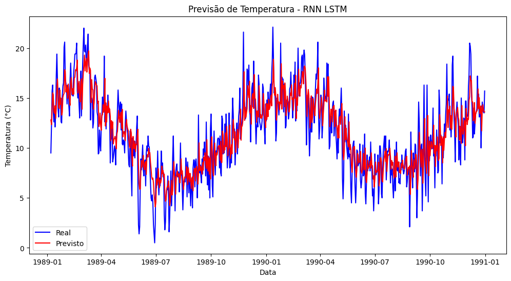

# 🔥 Previsão de Séries Temporais com RNN (LSTM)

Este projeto implementa uma **Rede Neural Recorrente (RNN)** do tipo **LSTM** para prever as **temperaturas mínimas diárias em Melbourne (Austrália)** usando dados históricos de 1981 a 1990.

---

## 📊 Dataset

O dataset utilizado é o **[Daily Minimum Temperatures](https://www.kaggle.com/datasets/mahmoudreda55/daily-minimum-temperatures-in-melbourne)** disponível no Kaggle.  
- **Date** → Data da observação (YYYY-MM-DD)  
- **Temp** → Temperatura mínima diária (°C)  

---

## 🧮 Métrica escolhida

A métrica de avaliação é o **RMSE (Root Mean Squared Error)**:  

- **Interpretação fácil**: resultado em °C, mesma unidade da variável.  
- **Penaliza grandes erros**: dá mais peso a previsões distantes do valor real.  
- **Relação com o problema**: em previsão de temperaturas, grandes desvios (ex.: frente fria repentina) são mais críticos e precisam ser penalizados com mais intensidade do que erros pequenos.  

> Exemplo: RMSE = 2.5 significa que, em média, o modelo errou **cerca de 2,5°C**.

---

## 🛠️ Implementação

O projeto foi desenvolvido no **Google Colab** com **TensorFlow/Keras**.  
Fluxo do pipeline:

1. **Coleta de dados**  
   - Dataset baixado diretamente do [GitHub mirror](https://raw.githubusercontent.com/jbrownlee/Datasets/master/daily-min-temperatures.csv).  

2. **Pré-processamento**  
   - Normalização dos dados com `MinMaxScaler`.  
   - Criação de janelas temporais (lags) para capturar dependências.  

3. **Modelagem**  
   - RNN com camadas LSTM:  
     ```text
     LSTM (50 unidades, return_sequences=True)
     LSTM (50 unidades)
     Dense (1 unidade de saída)
     ```

4. **Treinamento**  
   - 20 épocas  
   - Batch size: 32  
   - Função de perda: `MSE`  
   - Otimizador: `Adam`  

5. **Avaliação**  
   - Cálculo do **RMSE em treino e teste**.  
   - Gráfico comparando valores reais (azul) vs previstos (vermelho).  

---

## 📈 Resultados

- **RMSE Treino**: ~2.5 °C  
- **RMSE Teste**: ~3.0 °C  

  

---

## 🚀 Como executar no Colab

1. Abra o Google Colab  
2. Importe o notebook deste repositório  
3. Rode os blocos na ordem:  
   - Download dos dados  
   - Pré-processamento  
   - Treinamento  
   - Avaliação  

---

## 📂 Estrutura do projeto

```bash
.
├── README.md               
├── rnn_temperature.ipynb    
└── exemplo_grafico.png     
